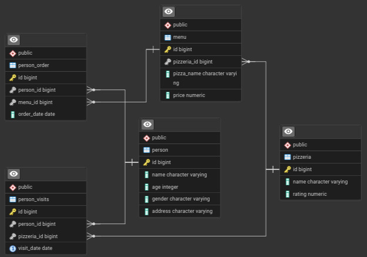

# <span><a href="https://21-school.ru/?utm_source=school21&utm_medium=student_nino&utm_campaign=trelawnm___"></a></span> The 21 School `SQL Bootcamp`

Applied PostgreSQL: Building production-ready SQL skills through 100+ practical exercises and real-world database challenges from School 21 curriculum. The project uses PostgreSQL and pgAdmin containers running in Docker Compose.


## Quick start
### Prerequisites
- Docker & Docker Compose

### Database Setup
1. Prepare DB directory (should be empty before proceed):
```bash
sudo rm materials/postgres-data/.gitkeep
```
2. Start containers:
```bash
sudo docker-compose up -d
```
3. Access pgAdmin at [`localhost:80`](http://localhost:80)
4. Connect to `Local PostgreSQL` DB with `school21` password

### Stop Services
```bash
docker-compose down
```

## Logical View of Database Model



## Learning Journey

- <a href="./basic/"><b>Day 00: First Steps in SQL</b></a>
- <a href="./sets-joins/"><b>Day 01: Sets & JOINs</b></a>
- <a href="./deep-joins/"><b>Day 02: Deep JOINs</b></a>
<!-- 
- Day 01: Building SQL Foundations
- Day 02: Deep Dive into Queries
- Day 03: Advanced SQL Patterns
- Day 04: SQL Optimization & Performance
- Day 05: Mastering Complex Scenarios
-->