## [ex00. Transaction Isolation](ex00/day08_ex00.sql)

Demonstrates transaction isolation by showing how uncommitted changes remain invisible to other sessions until committed, ensuring data consistency across concurrent database connections.

📋 Execution Evidence

### *Session #1: Complete Transaction Flow*
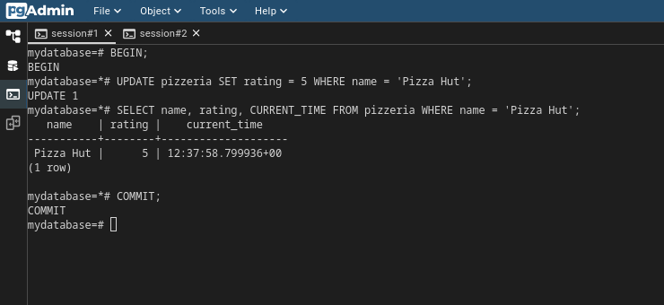

*Demonstrates: BEGIN → UPDATE rating to 5.0 → Verify changes locally (shows 5.0) → COMMIT to publish changes*

### *Session #2: Isolation Proof*  
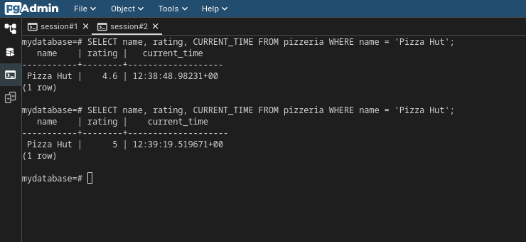

*Demonstrates: First SELECT shows original rating (4.6) while Session #1's transaction is active → Second SELECT after Session #1's COMMIT reflects the updated rating (5.0) → Proves transaction isolation in Read Committed level*

## [ex01. Lost Update Anomaly](ex01/day08_ex01.sql)

Reproduces the Lost Update anomaly where concurrent rating updates conflict, showing how one session's changes can overwrite another's without proper isolation controls.

📋 Execution Evidence

### *Session #1: Initial Update Attempt*
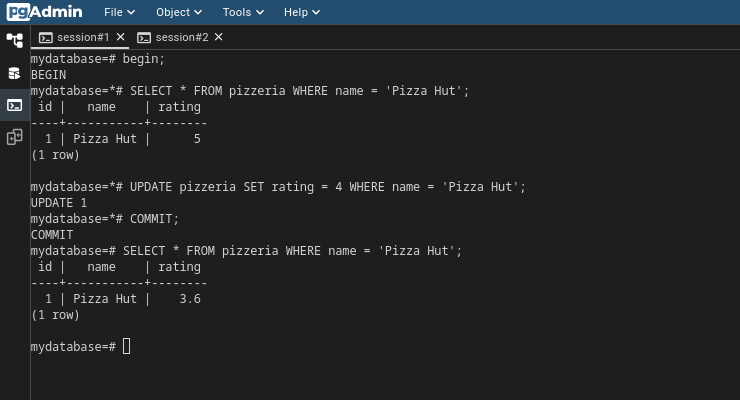

*Demonstrates: BEGIN → SELECT (reads rating 5) → UPDATE to 4.0 → Final SELECT shows 3.6 locally*

### *Session #2: Conflicting Update*  
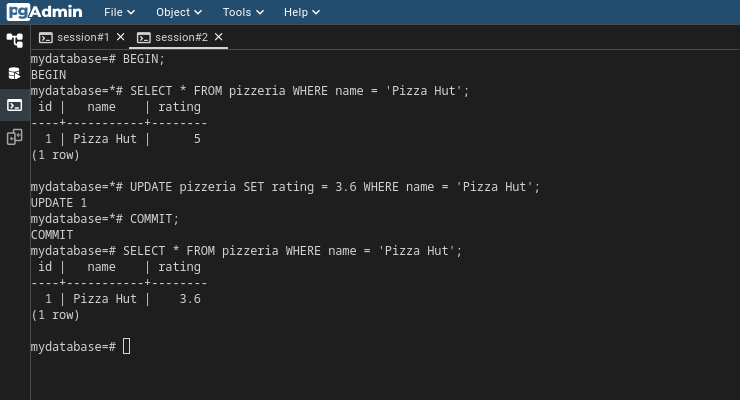

*Demonstrates: BEGIN → SELECT (also reads 5) → UPDATE to 3.6 blocked waiting for Session #1 → After Session #1 COMMIT, UPDATE proceeds but overwrites to 3.6 → Final result: Session #1's update to 4.0 is LOST*

## [ex02. Lost Update for Repeatable Read](ex02/day08_ex02.sql)

Tests Repeatable Read isolation level's ability to prevent Lost Update anomalies by maintaining consistent data views throughout transaction duration.

📋 Execution Evidence

### *Session #1: Update Under Repeatable Read*
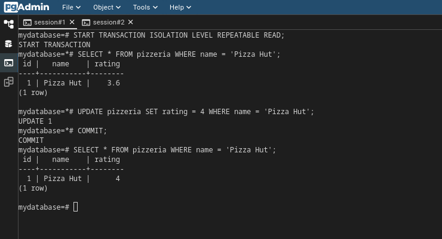

*Demonstrates: START TRANSACTION ISOLATION LEVEL REPEATABLE READ → SELECT (reads rating 3.6) → UPDATE to 4.0 → COMMIT publishes changes*

### *Session #2: Concurrent Update Detection*  
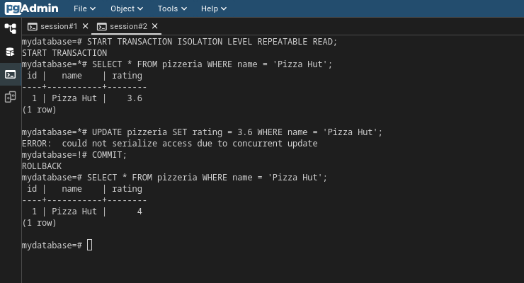

*Demonstrates: START TRANSACTION ISOLATION LEVEL REPEATABLE READ → SELECT (reads rating 3.6) → UPDATE to 3.6 blocked → After Session #1 COMMIT, UPDATE fails due to concurrent modification → Transaction rollback on commit*

## [ex03. Non-Repeatable Reads Anomaly](ex03/day08_ex03.sql)

Demonstrates Non-Repeatable Reads anomaly where committed changes from one session become visible to another during transaction execution.

📋 Execution Evidence

### *Session #1: Transaction with Multiple Reads*
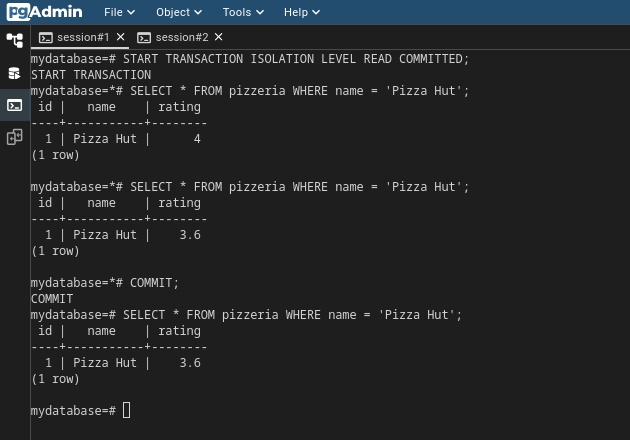

*Demonstrates: BEGIN → First SELECT shows rating 4 → After Session #2's update, second SELECT shows 3.6 → Non-repeatable read detected within same transaction*

### *Session #2: Interleaving Update*  
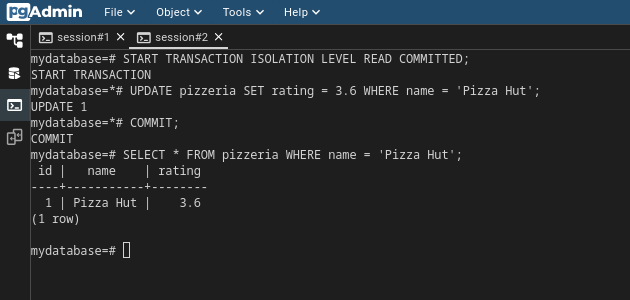

*Demonstrates: BEGIN → UPDATE rating to 3.6 → COMMIT makes changes visible to Session #1 → Shows how committed changes affect ongoing transactions*

## [ex04. Non-Repeatable Reads for Serialization](ex04/day08_ex04.sql)

Validates Serializable isolation level's protection against Non-Repeatable Reads by ensuring transaction consistency through strict serial execution.

📋 Execution Evidence

### *Session #1: Serializable Transaction*
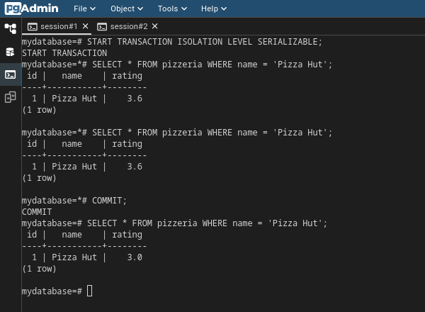

*Demonstrates: START TRANSACTION ISOLATION LEVEL SERIALIZABLE → First SELECT shows rating 3.6 → Second SELECT still shows 3.6 despite Session #2's update → Serializable isolation prevents non-repeatable reads*

### *Session #2: Concurrent Update Attempt*  

*Demonstrates: START TRANSACTION ISOLATION LEVEL READ COMMITTED → UPDATE rating to 3.0 → COMMIT succeeds but doesn't affect Session #1's consistent view → Shows serializable isolation maintaining transaction snapshot*

## [ex05. Phantom Reads Anomaly](ex05/day08_ex05.sql)

Reproduces Phantom Reads anomaly where new data inserted during transaction execution affects aggregate query results inconsistently.

📋 Execution Evidence

### *Session #1: Aggregate Query Transaction*
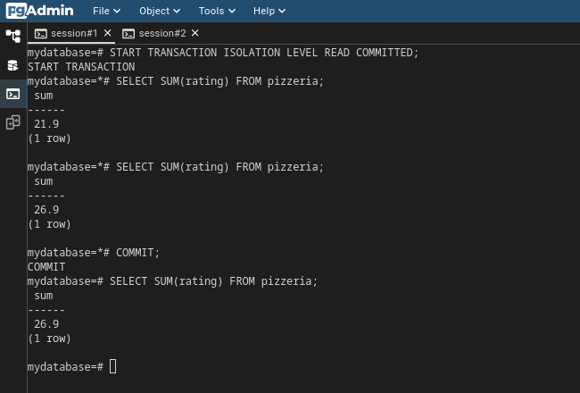

*Demonstrates: BEGIN → First SUM calculation returns 21.9 → After Session #2's INSERT, second SUM returns 26.9 → Phantom read detected with new row appearing*

### *Session #2: Data Insertion*  
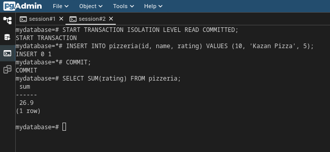

*Demonstrates: BEGIN → INSERT new pizzeria 'Kazan Pizza' with rating 5 → COMMIT makes new row visible → Shows how phantom reads occur in Read Committed isolation*

## [ex06. Phantom Reads for Repeatable Read](ex06/day08_ex06.sql)

Tests Repeatable Read isolation's effectiveness against Phantom Reads by maintaining stable data snapshots despite concurrent insertions.

📋 Execution Evidence

### *Session #1: Repeatable Read Transaction*
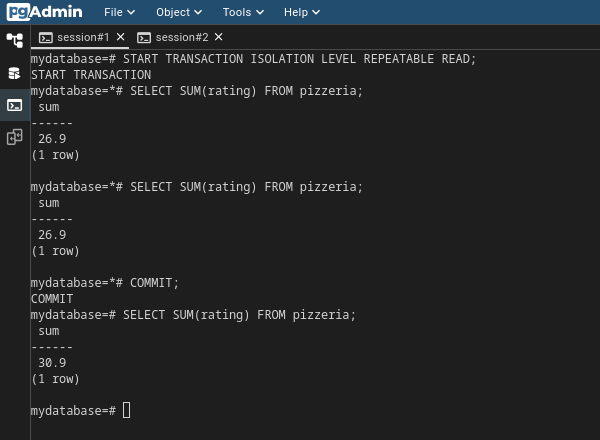

*Demonstrates: START TRANSACTION ISOLATION LEVEL REPEATABLE READ → First SUM returns 26.9 → Second SUM still returns 26.9 despite Session #2's INSERT → Phantom read prevented*

### *Session #2: Concurrent Insertion*  
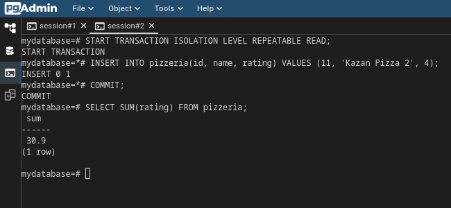

*Demonstrates: BEGIN → INSERT new pizzeria 'Kazan Pizza 2' with rating 4 → COMMIT succeeds but doesn't affect Session #1's consistent snapshot*

## [ex07. Deadlock](ex07/day08_ex07.sql)

Creates and analyzes a deadlock scenario where two sessions block each other's updates, demonstrating database deadlock detection and resolution mechanisms.

📋 Execution Evidence

### *Session #1: Successful Transaction*
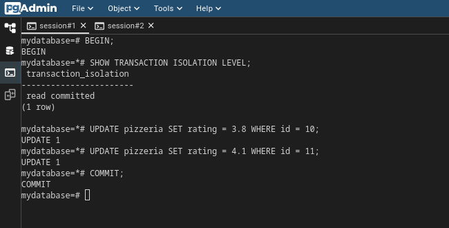

*Demonstrates: BEGIN → UPDATE pizzeria SET rating=3.8 WHERE id=10 → Session holds lock on id=10 → Attempts UPDATE on id=11 → While Session #2 was terminated with deadlock error, this session successfully commits all changes*

### *Session #2: Conflicting Update Pattern*  
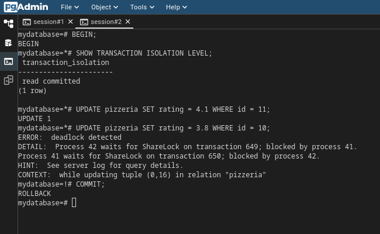

*Demonstrates: BEGIN → UPDATE pizzeria SET rating=4.1 WHERE id=11 → Session holds lock on id=11 → Attempts UPDATE on id=10 but encounters deadlock → Database detects circular dependency (Process 41 vs Process 42) → This transaction is aborted with "deadlock detected" error → COMMIT results in automatic ROLLBACK*

